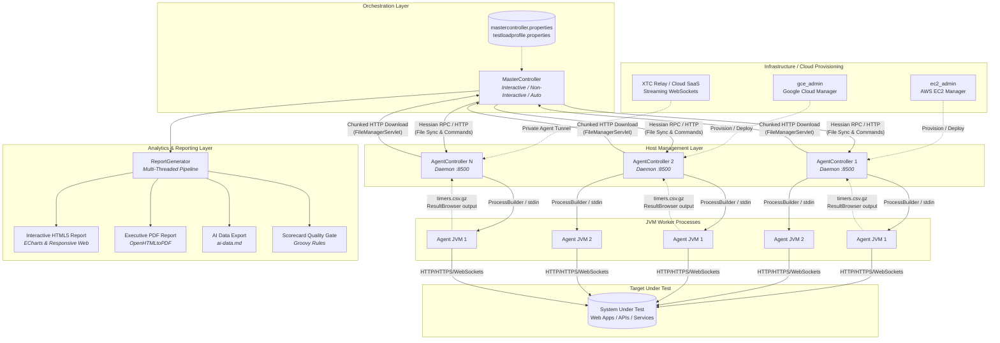
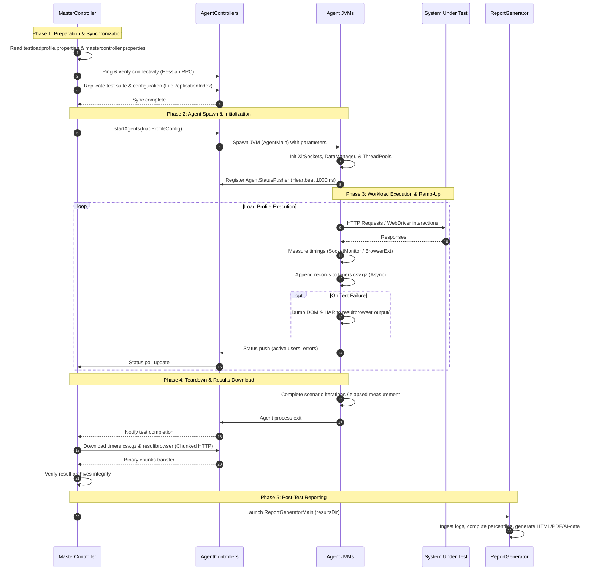
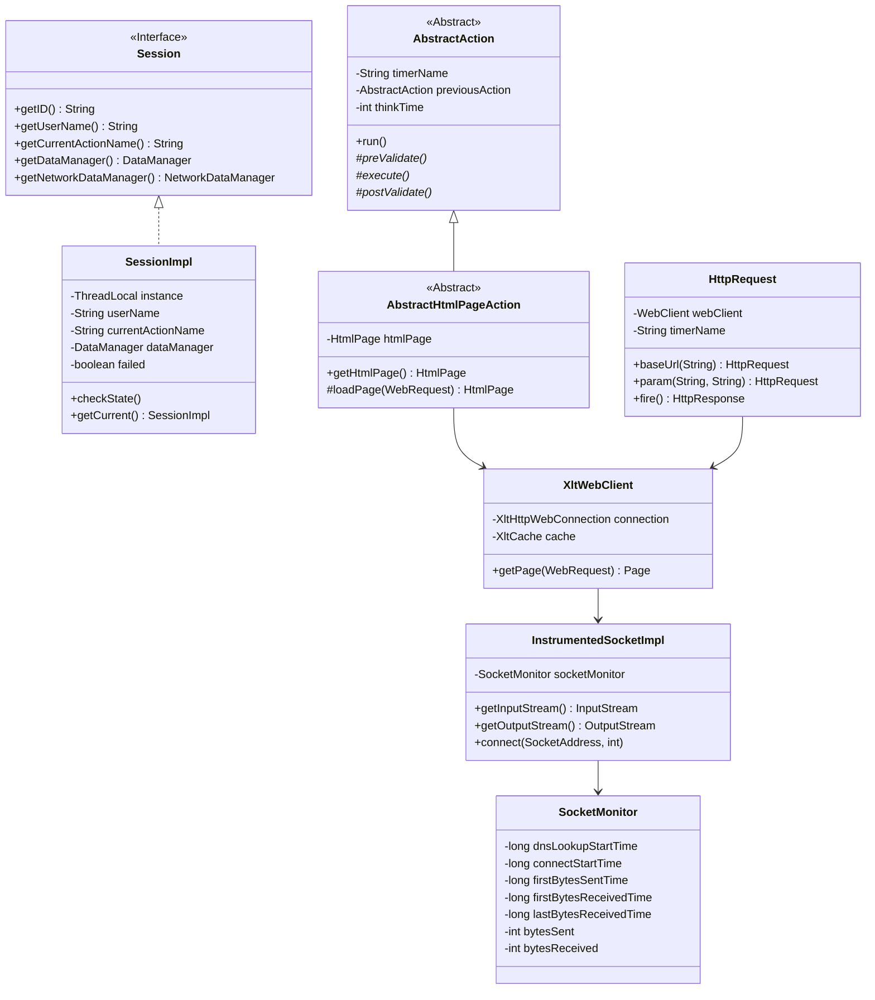
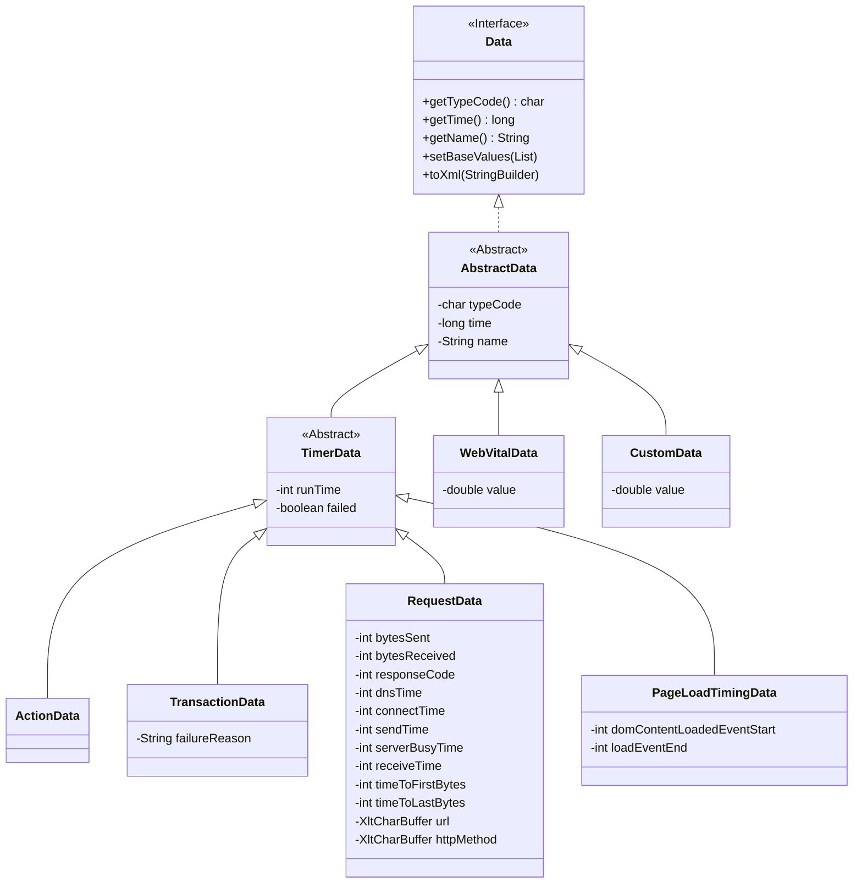
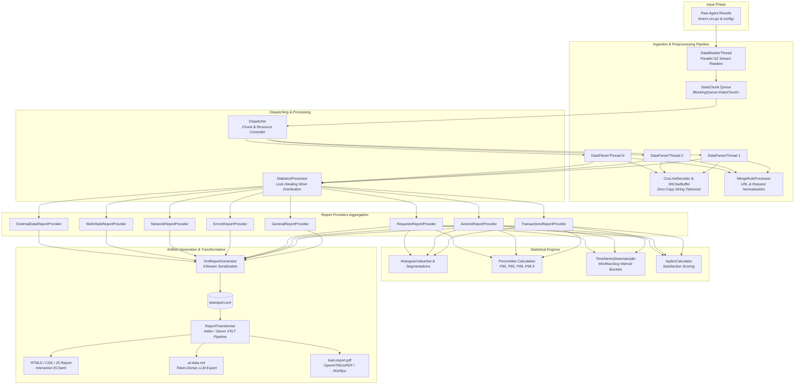
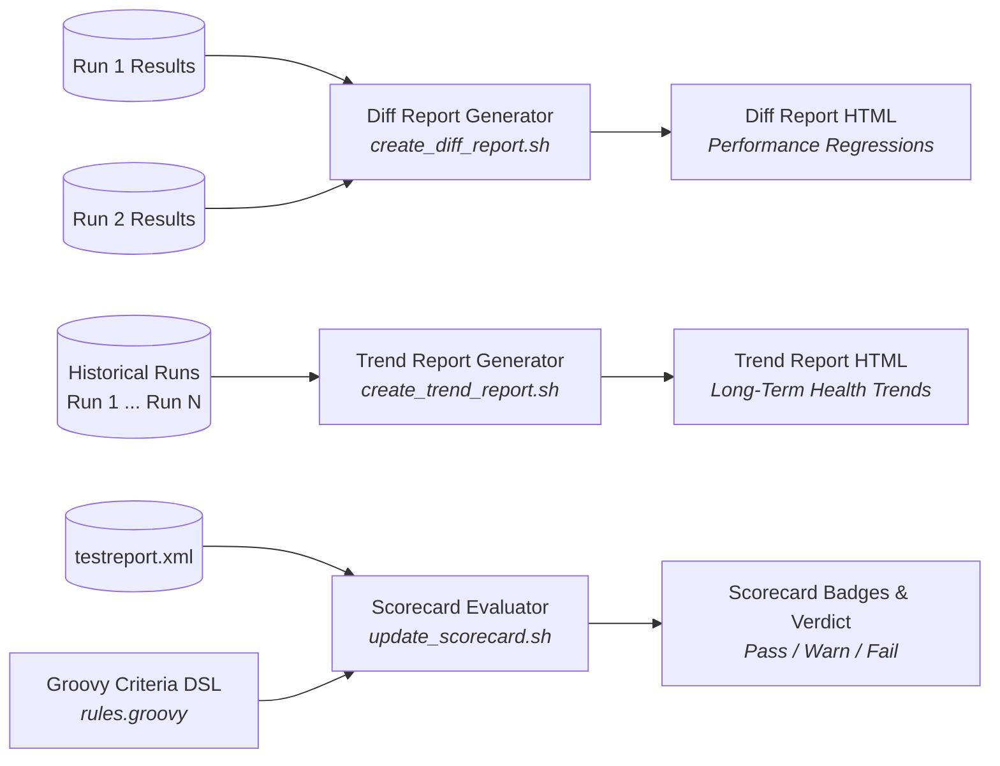

# Architecture Documentation of XLT (Xceptance LoadTest)

## 1. Executive Summary & Core Principles

**XLT (Xceptance LoadTest)** is an enterprise-grade, distributed load and performance testing suite developed in Java by [Xceptance](https://www.xceptance.com/). It provides end-to-end capabilities spanning test script authoring, distributed load generation, real-time cluster orchestration, network-level metric instrumentation, and high-throughput statistical report generation.

### 1.1 Architectural Pillars
1. **Extreme Measurement Fidelity**: XLT instruments the Java TCP socket layer (`InstrumentedSocketImpl`) and browser network stacks (`timerrecorder` extensions) to capture exact network-level timing breakdowns—DNS resolution, TCP connection establishment, request send duration, server busy/think time (Time to First Byte - TTFB), response download time (Time to Last Byte - TTLB), and raw wire byte counts.
2. **Dual-Model Execution Engine**:
   - *Protocol/Headless Mode*: Ultra-lightweight HTTP request execution (`HttpRequest`, `XltWebClient`, `HtmlUnitDriver`, and `XltDriver`) delivering thousands of concurrent virtual users per load machine with minimal memory and CPU overhead.
   - *Real-Browser Mode*: Automated real browser execution (`XltChromeDriver`, `XltFirefoxDriver`) capturing Web Vitals (LCP, CLS, FID/INP), DOM rendering milestones, and complete client-side execution timings.
3. **Decoupled Distributed Topology**: MasterController orchestrates autonomous AgentController nodes over lightweight RPC (Hessian over HTTP/HTTPS) and chunked HTTP transport, allowing linear scalability across local networks, cloud infrastructure (AWS EC2, Google Cloud Engine), and XTC (Xceptance Test Center SaaS).
4. **Zero-Allocation Data Pipeline**: Custom zero-copy data buffers (`XltCharBuffer`), dedicated non-allocating CSV decoders (`CsvLineDecoder`), primitive and clock-cache collections (`FastHashMap`, `LRUClockMap`), and streaming GZIP logs allow processing hundreds of millions of data points without garbage collection pauses.
5. **Multi-Channel Analytical Output**: Generates interactive HTML5/ECharts single-page reports, executive PDF documents (pure Java via OpenHTMLtoPDF), machine-optimized Markdown/YAML exports for LLMs (`ai-data.md`), differential regression analyses (Diff Reports), historical multi-test trend analyses (Trend Reports), and automated SLA quality gates (Groovy-based Scorecards).

---

## 2. Distributed System Topology

XLT operates as a distributed system with a clear separation of concerns between orchestration, host-level management, workload execution, and analytics.



### 2.1 The Components

#### MasterController (`com.xceptance.xlt.mastercontroller`)
- **Role**: Central controller that drives the entire load test lifecycle.
- **Key Responsibilities**:
  - Resolves load profile parameters (`TestLoadProfileConfiguration`) including total virtual users, ramp-up schedules, steady periods, warm-up phases, and arrival rates.
  - Distributes virtual users across configured agent controllers according to machine weights (`com.xceptance.xlt.mastercontroller.agentcontrollers.<id>.weight`).
  - Synchronizes test suite code, binaries, datasets, and configuration directories (`TestDeployer`, `FileReplicationUtils`) across agent controllers using incremental cryptographic indexing (`FileReplicationIndex`).
  - Launches test execution and monitors status concurrently using `AgentControllerStatusUpdater` and poll threads.
  - Interactively or non-interactively (`BasicConsoleUI`, `InteractiveUI`, `NonInteractiveUI`, `FireAndForgetUI`) provides live terminal feedback on active users, TPS, and error rates.
  - Downloads compressed test results concurrently using chunked transfers with retry semantics (`ResultDownloader`).
  - Optionally kicks off post-execution report generation.

#### AgentController (`com.xceptance.xlt.agentcontroller`)
- **Role**: Long-running daemon listening on a designated port (default `8500`) over HTTPS.
- **Key Responsibilities**:
  - Exposes management APIs via Hessian binary RPC (`AgentControllerProxy` / `AgentControllerImpl`).
  - Provides a built-in file synchronization and chunked streaming endpoint (`FileManagerServlet`, `PartialGetUtils`).
  - Launches and supervises local load agent child JVMs (`AgentManagerImpl`, `AgentImpl`) via `ProcessBuilder`.
  - Feeds load profile configurations (`TestUserConfiguration`) to agents via IPC.
  - Collects child agent heartbeats, CPU/memory stats, and error statuses, relaying them back to MasterController.
  - Handles XTC private machine mode (`xtc/RelayClient`, `StreamingWebSocketClient`) to tunnel commands and results securely from outside firewalls without requiring inbound public ports.

#### Agent (`com.xceptance.xlt.agent`)
- **Role**: High-performance load generator process running in an independent Java Virtual Machine.
- **Key Responsibilities**:
  - Instantiates `LoadTest` and spawns dedicated thread pools managed by `LoadTestRunner`.
  - Sets up the global socket instrumentation (`XltSockets`) for packet-level timing measurement.
  - Executes virtual user test cases according to scenario models, handling pacing, think time distributions, and loop counts.
  - Runs custom samplers (`CustomSamplersRunner`, `JvmResourceUsageDataGenerator`) for JVM garbage collection, heap, and host resource telemetry.
  - Streams performance records directly to disk into GZIP-compressed CSV files (`timers.csv.gz`) via asynchronous loggers (`DataLoggerImpl`, `DataManagerImpl`).
  - Captures debugging snapshots and HTTP Archive (HAR) dumps into `output/` via `DumpMgr` upon transaction errors.

#### Cloud & Provisioning Extensions (`com.xceptance.xlt.ec2`, `com.xceptance.xlt.gce`)
- **AWS EC2 Admin**: Automated provisioning, AMI tagging, firewall/security group configuration, and lifecycle management for Amazon Web Services EC2 instances.
- **GCE Admin**: Automated cluster setup, instance group creation, health verification, and teardown for Google Compute Engine.

---

## 3. Test Execution Lifecycle & Orchestration

The end-to-end execution of an XLT load test moves through distinct, synchronized phases managed by the MasterController:



### 3.1 Load Profiles & Execution Schedules
Workload profiles are defined per test case in `config/testloadprofile.properties`:
- `testcase.class`: Fully qualified test class name implementing a JUnit test or scenario.
- `testcase.users`: Number of parallel virtual users.
- `testcase.iterations`: Number of scenario repetitions per user (or infinite/timed).
- `testcase.initialDelay`: Staggered startup delay before a user starts running.
- `testcase.warmUpPeriod`: Time allowed for JVM JIT warm-up; data collected during this window is optionally excluded from reports.
- `testcase.rampUpPeriod`: Duration over which user threads incrementally start.
- `testcase.rampUpSteadyPeriod`: Intermediate steady state after ramp-up before measurement begins.
- `testcase.measurementPeriod`: Core measurement duration.
- `testcase.shutdownPeriod`: Graceful ramp-down period.
- `testcase.arrivalRate`: Target transaction execution rate (scenarios per minute/hour), converting closed user models into open arrival models using dynamic execution timers (`PeriodicExecutionTimer`, `RandomExecutionTimer`).

---

## 4. Execution Engine Architecture (`com.xceptance.xlt.engine`)

The execution engine is the heartbeat of XLT. It isolates virtual user state, controls action transactions, intercepts socket traffic, and provides browser automation abstractions.



### 4.1 Virtual User Isolation: `Session` & `SessionImpl`
Every virtual user runs within a dedicated thread context bound via `ThreadLocal<SessionImpl>`:
- **Identity**: Holds the user ID, virtual user index, scenario name, and iteration counter.
- **Transaction State**: Tracks the currently executing action name, think time parameters, and failure states.
- **Lifecycle Listeners**: `SessionShutdownListener` callbacks ensure complete release of network connections, cookies, web clients, and memory buffers upon session completion.

### 4.2 The Action Paradigm (`AbstractAction`)
XLT models user journeys through structured actions rather than unstructured scripts. An action represents an atomic user interaction (e.g., clicking a button, submitting a form, calling an API endpoint):
```
Action Execution Flow:
[Think Time Pacing] -> [preValidate()] -> [execute()] -> [postValidate()]
```
1. **Pacing / Think Time**: Enforces configurable pauses between actions (`com.xceptance.xlt.thinktime.action`), with random Gaussian or uniform deviations to model realistic user behavior. Think time is automatically skipped before the very first action.
2. **`preValidate()`**: Verifies that prerequisites from the previous page or state are satisfied (e.g., button present, session token available). Errors here prevent invalid requests from polluting test statistics.
3. **`execute()`**: Triggers the actual HTTP requests or WebDriver commands.
4. **`postValidate()`**: Validates response codes, content assertions, DOM elements, or business logic conditions.
5. **Timer Recording**: The action runtime (elapsed duration of `execute()` and `postValidate()`) is measured using high-resolution monotonic clocks (`TimerUtils`) and recorded into an `ActionData` record. All HTTP requests issued during `execute()` inherit the action's name as their logical parent.

### 4.3 Network & Socket Instrumentation (`com.xceptance.xlt.engine.socket`)
Unlike standard load testing tools that infer timings from high-level client libraries, XLT replaces Java's global `SocketImplFactory` with `InstrumentedSocketImplFactory`:
- **`InstrumentedSocketImpl`**: Hooks directly into the JVM's underlying networking stack (`PlainSocketImpl` or Java 13+ `NioSocketImpl`).
- **`SocketMonitor`**: Tracks microsecond-accurate networking timestamps per thread:
  - **DNS Resolution Time**: `dnsLookupEndTime - dnsLookupStartTime`
  - **TCP Connect Time**: `connectEndTime - connectStartTime`
  - **Send Time**: Duration between first and last byte written to `InstrumentedOutputStream`.
  - **Server Busy / Wait Time (TTFB)**: Duration between the last byte sent and the first byte arriving on `InstrumentedInputStream`.
  - **Receive Time (TTLB)**: Duration from the first byte arriving to the final stream read.
  - **Exact Wire Volume**: Exact byte counters on wire sent and received, capturing TLS handshake overhead and compressed transfer encoding sizes.
- **Custom DNS Subsystem**: `XltDnsResolver`, `DnsJavaHostNameResolver`, and `DnsOverrideResolver` enable synthetic DNS caching, custom DNS servers, and dynamic host-to-IP overrides per agent.

### 4.4 Browser Automation & Web Driver Stack
XLT provides multiple browser simulation tiers:
1. **`HttpRequest` (Fluent API)**: Lightweight, direct REST/HTTP execution without DOM evaluation. Perfect for high-volume microservice load tests.
2. **`XltWebClient` & `LightWeightPage`**: HtmlUnit-based headless browser executing HTTP without parsing full JavaScript/DOM, providing high throughput.
3. **`XltDriver` & `HtmlUnitDriver`**: Full W3C WebDriver implementation executing on top of HtmlUnit with headless JavaScript execution.
4. **`XltChromeDriver` & `XltFirefoxDriver`**: Real browser drivers packaged with XLT's native browser extension (`timerrecorder`). The extension communicates with XLT via local WebSockets (`WebExtConnectionHandler`), streaming navigation timings, resource timing entries, W3C Web Vitals (LCP, CLS, FID/INP), and full network waterfall events directly into XLT's metrics pipeline.

### 4.5 Error Diagnostics & ResultBrowser
When a transaction fails or assertion errors occur, XLT captures comprehensive post-mortem diagnostics:
- **`DumpMgr`**: Dumps current DOM snapshots (`PageDOMClone`), active cookies, and execution histories into the `output/` directory.
- **`HarExporter`**: Generates full W3C HAR 1.2 files containing complete request/response headers, parameters, and timings.
- **Static Result Browser**: Automatically bundles a standalone, client-side web application (`index.html`, JavaScript, CSS) inside each error dump. Engineers can open the result folder in any standard browser to inspect the visual rendering of the page at the exact moment of failure, toggle between requests, and examine response bodies.

---

## 5. Metrics Architecture & Data Logging

XLT uses an event-driven, low-overhead data recording architecture designed to minimize GC pressure during massive concurrent load.



### 5.1 Data Record Hierarchy & Wire Format
Data records are written to CSV files using a compact, single-character prefix schema:

| Type Code | Class | Description | Primary Fields |
|:---:|:---|:---|:---|
| **`T`** | `TransactionData` | Full test case scenario run | Name, StartTime, RunTime, Failed (T/F), ErrorMessage |
| **`A`** | `ActionData` | High-level user interaction action | Name, StartTime, RunTime, Failed (T/F) |
| **`R`** | `RequestData` | Low-level HTTP/Network request | Name, StartTime, RunTime, Failed, HTTP Status, Bytes Sent, Bytes Recv, Connect, Send, ServerBusy, Recv, TTFB, TTLB, DNS, URL, Method |
| **`C`** | `CustomData` | Custom application timer | Name, StartTime, RunTime, Failed |
| **`V`** | `CustomValue` | Custom numeric metric/gauge | Name, StartTime, Value |
| **`E`** | `EventData` | Custom event or error occurrence | Name, StartTime, EventName, Message |
| **`J`** | `JvmResourceUsageData` | JVM memory, GC, and CPU usage | Name, StartTime, HeapUsed, HeapCommitted, NonHeapUsed, CpuUsage |
| **`P`** | `PageLoadTimingData` | Client browser navigation timings | Name, StartTime, NavigationStart, DomInteractive, DomComplete, LoadEvent |
| **`W`** | `WebVitalData` | Real user Web Vitals | Name, StartTime, MetricName (LCP/CLS/FID/INP), MetricValue |

### 5.2 Asynchronous Streaming Storage
- Virtual user threads do not write directly to disk synchronously.
- Instead, records pass through `DataManagerImpl` and are buffered in high-performance memory queues before `DataLoggerImpl` flushes them to compressed `timers.csv.gz` files.
- Thread-safety is achieved with minimal lock contention, preventing data logging from skewing transaction response time measurements.

---

## 6. Report Generation Pipeline (`com.xceptance.xlt.report`)

The XLT Report Generator transforms gigabytes of raw, compressed event logs into an interconnected web of statistical metrics, interactive visual charts, executive summaries, and AI models.



### 6.1 Multi-Threaded Ingestion Pipeline
1. **Discovery & Time Boundary Determination**: The generator locates all agent result subdirectories. It scans initial records to compute the active load test time window, accounting for warm-up or ramp-up exclusions (`--no-rampup`).
2. **`DataReaderThread`**: Reads gzip streams in memory-bounded blocks, emitting `DataChunk` objects into a bounded `LinkedBlockingQueue`.
3. **`DataParserThread`**: Worker threads pool chunks from the queue. Each thread parses lines using `CsvLineDecoder` and creates typed records via `DataRecordFactory`.
4. **Merge & Labeling Rules (`MergeRuleProcessor`)**: Requests are normalized dynamically:
   - Removes auto-incremented IDs (e.g., `AddToCart.1.4` -> `AddToCart`).
   - Normalizes dynamic REST URL paths and query parameters (e.g., `/items/12345` -> `/items/{id}`) to prevent cardinality explosions in metrics tables.
5. **`StatisticsProcessor` & Lock-Stealing Pattern**: Ingested data is handed off to the registered `ReportProvider` instances. Rather than locking all providers under a global mutex, `StatisticsProcessor` uses non-blocking lock acquisition (`provider.lock()`), feeding records to whichever provider is currently free, maximizing multi-core throughput.

### 6.2 Statistical Calculation Engine
- **Percentiles & Histograms**: Calculates precise percentiles ($p_{50}, p_{90}, p_{95}, p_{99}, p_{99.9}$) using `HistogramValueSet`, `DoubleMinMaxValueSet`, and `RuntimeHistogram`.
- **Time Series Downsampling (`TimeSeriesDownsampler`)**: Divides test execution time into uniform intervals (e.g., 5 seconds or 1 minute). Within each interval, it calculates count/sec, error rate, minimum, maximum, and average response times, keeping chart datasets compact regardless of total test duration.
- **Apdex (Application Performance Index)**: `ApdexCalculator` computes industry-standard user satisfaction scores ($T$ = target threshold, $4T$ = tolerating threshold):
  $$\text{Apdex} = \frac{\text{Satisfied Count} + \frac{\text{Tolerating Count}}{2}}{\text{Total Count}}$$
- **Concurrency Tracking**: `ConcurrentUsersTable` reconstructs exact parallel user concurrency curves over the entire test duration.

### 6.3 Multi-Format Reporting Artifacts
1. **XML Data Model (`testreport.xml`)**:
   - High-fidelity serialization of all provider statistics using XStream.
   - Contains raw aggregated tables, time series arrays, error groups, and system configuration.
2. **Interactive HTML5 Report**:
   - `ReportTransformer` compiles modular XSLT templates (`config/xsl/loadreport/`) against `testreport.xml`.
   - Generates responsive, standalone HTML pages (`index.html`, `transactions.html`, `requests.html`, `errors.html`, `slowest-requests.html`, `network.html`, `web-vitals.html`, `agents.html`).
   - Visualizations are rendered via [Apache ECharts](https://echarts.apache.org/), supporting interactive zooming, time-range selection, series toggling, and dark/light themes.
3. **AI-Optimized Data Export (`ai-data.md`)**:
   - Compact Markdown and YAML summary formatted specifically for consumption by Large Language Models (LLMs).
   - Omits redundant XML structure; presents statistics in dense Markdown tables with explicit units, drastically reducing token usage while maximizing analysis reasoning quality.
4. **Executive PDF Report (`load-report.pdf`)**:
   - Pure Java rendering via OpenHTMLtoPDF and Apache PDFBox.
   - Generates an executive-ready A4 document containing key KPIs, rating grades (A+ to F), summary charts, and top error lists without needing headless Chrome or Puppeteer.

---

## 7. Performance Engineering Innovations

A core differentiator of XLT is its deliberate engineering for extreme computational efficiency and minimal garbage collection pauses:

### 7.1 Zero-Copy String Views: `XltCharBuffer`
Java `String` instances are immutable and generate significant heap churn when substringing or parsing millions of CSV tokens. XLT introduces `XltCharBuffer`:
- Represents a flyweight window/view `(char[] src, int from, int length)` over a shared underlying character buffer.
- Implements `CharSequence` and `Comparable<XltCharBuffer>`, allowing direct regular expression evaluation and sorting without heap reallocations.
- Custom hash calculation matches `String.hashCode()`, allowing zero-allocation lookups in map collections.

### 7.2 Non-Allocating CSV Decoding: `CsvLineDecoder`
- Standard CSV parsers (`String.split()` or regex) allocate dozens of intermediate string objects per line.
- `CsvLineDecoder` scans the underlying character array directly, extracting tokens as slices of `XltCharBuffer` into a pre-allocated `SimpleArrayList`.
- Avoids quote copying and memory duplication, achieving parsing speeds exceeding millions of records per second per thread.

### 7.3 Primitive & Clock Cache Collections
- **`FastHashMap`**: High-performance open-addressing hash map with lower overhead than `java.util.HashMap`.
- **`LRUClockMap` / `ConcurrentLRUCache`**: Non-blocking Least-Recently-Used caches employing CLOCK eviction algorithms to avoid synchronized linked lists.
- **`SimpleArrayList`**: Lightweight array list variant with exposed backing arrays and unchecked indexed access to eliminate method invocation overhead in hot loops.

---

## 8. Multi-Test Analytics & Advanced Subsystems

Beyond single-run reports, XLT includes analytics tools for release comparisons, continuous benchmarking, and quality gating:



### 8.1 Diff Report Generator (`com.xceptance.xlt.report.diffreport`)
- Evaluates two load test runs (e.g., baseline vs. release candidate).
- Calculates delta percentages for response times, error counts, throughput, and system resource utilization.
- Highlights regressions with automatic color coding.

### 8.2 Trend Report Generator (`com.xceptance.xlt.report.trendreport`)
- Ingests multiple sequential test reports to analyze performance drift over time.
- Plots historical trends of transaction duration, request latency percentiles, and error frequencies across build versions.

### 8.3 Scorecard & Groovy Evaluation Engine (`com.xceptance.xlt.report.scorecard`)
- Automated quality gate for CI/CD pipelines.
- Evaluates user-defined rules and SLA criteria written in a Groovy-based Domain Specific Language (DSL).
- Evaluates performance metrics against target criteria, assigning grades (`A+` through `F`) and generating machine-readable pass/fail verdicts (`check_criteria.sh`).

---

## 9. Comprehensive Architectural Directory Map

```
xlt/
├── bin/                          # Shell & batch launchers
│   ├── mastercontroller.sh/cmd   # Test orchestrator entry point
│   ├── agentcontroller.sh/cmd    # Local host agent controller daemon
│   ├── agent.sh/cmd              # Direct load agent launcher
│   ├── create_report.sh/cmd      # Statistical report generator
│   ├── create_diff_report.sh/cmd # Run comparison diff generator
│   ├── create_trend_report.sh/cmd# Historical trend analyzer
│   ├── update_scorecard.sh/cmd   # Groovy criteria scorecard updater
│   ├── ec2_admin.sh/cmd          # AWS EC2 cluster administrator
│   └── gce_admin.sh/cmd          # Google Compute Engine cluster administrator
├── config/                       # Central configuration files
│   ├── mastercontroller.properties
│   ├── agentcontroller.properties
│   ├── reportgenerator.properties
│   ├── diffreportgenerator.properties
│   ├── trendreportgenerator.properties
│   ├── ec2_admin.properties
│   ├── gce_admin.properties
│   └── xsl/                      # XSLT stylesheets for reports (load, diff, trend, scorecard)
└── src/main/java/com/xceptance/
    ├── common/                   # High-performance foundation utilities
    │   ├── collection/           # FastHashMap, LRUClockMap, ConcurrentLRUCache
    │   ├── io/                   # XltBufferedLineReader, FileUtils
    │   ├── lang/                 # OpenStringBuilder, StringHasher, ParseNumbers
    │   └── util/                 # CsvLineDecoder, CsvUtils, Balancer
    └── xlt/
        ├── api/                  # Public Test & Framework API
        │   ├── actions/          # AbstractAction, AbstractHtmlPageAction, AbstractWebAction
        │   ├── data/             # DataPool, DataProvider, DataSetProvider
        │   ├── engine/           # Session, DataManager, TimerData, RequestData, ActionData
        │   ├── htmlunit/         # LightWeightPage
        │   ├── tests/            # AbstractTestCase, AbstractWebDriverTestCase
        │   ├── util/             # XltCharBuffer, XltProperties, XltRandom, XltLogger
        │   ├── validators/       # HttpResponseCodeValidator, StandardValidator
        │   └── webdriver/        # XltDriver, XltChromeDriver, XltFirefoxDriver
        ├── mastercontroller/     # Distributed cluster orchestration & UI
        ├── agentcontroller/      # Node management, process supervision, XTC relay
        ├── agent/                # Load agent runtime, LoadTestRunner, timers, samplers
        ├── engine/               # Core execution engine
        │   ├── socket/           # InstrumentedSocketImpl, SocketMonitor (low-level metrics)
        │   ├── dns/              # DnsJavaHostNameResolver, DnsMonitor
        │   ├── httprequest/      # HttpRequest, HttpResponse fluent client
        │   ├── xltdriver/        # Headless W3C WebDriver implementation over HtmlUnit
        │   ├── resultbrowser/    # DumpMgr, HarExporter, DOM snapshots
        │   └── scripting/        # XlteniumScriptInterpreter, XML test runner
        └── report/               # Analytical processing & report generation
            ├── providers/        # Report fragment providers (Requests, Actions, Errors, etc.)
            ├── mergerules/       # Request name and URL normalization rules
            ├── criteria/         # SLA validation criteria
            ├── diffreport/       # Test comparison engine
            ├── trendreport/      # Historical trend engine
            ├── scorecard/        # Groovy-driven scorecard criteria engine
            └── pdf/              # Executive PDF report generation
```
